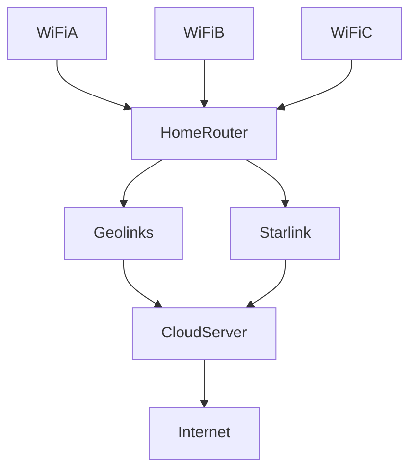

# Bonded Internet Connection

A bonded internet connection is a connection is two more more internet connections **bonded** into an effective single connection. 

The new connection has bandwidth approximately equal to the sum of the bandwidths of the bonded connections.

Typically bonded connections support failover, so if one of the connections fails, active connections will continue without failing.

## Required Hardware and Software
- 3 or more port mini computer/router
- pfSense
- Cloud Server

For this example, we will be using a [Protectli Vault FW4B - 4 Port, Firewall Micro Appliance](https://www.amazon.com/dp/B07G7H4M73?tag=murraynet-20&linkCode=osi&th=1).

Since it comes with low quality RAM and storage, we'll also buy :

 - [Samsung Original 8GB (1 x 8GB) 204-pin SODIMM, DDR3](https://www.amazon.com/gp/product/B0173ZBC2E/ref=ox_sc_act_title_1?smid=A91YWXUX63ZCY&psc=1)
 - [Transcend 128GB SATA III 6GB/S MSA230S mSATA SSD 230S Solid State Drive TS128GMSA230S](https://www.amazon.com/gp/product/B07GMD5R7M/ref=ox_sc_act_title_3?smid=ATVPDKIKX0DER&th=1)

Price: $425

### Cloud Server
Let's use a DigitalOcean Droplet, with 2TB of transfer. These come out to be about $12/month.

### Software Options

This part is still a bit undefined, but I think using [pfSense](https://www.pfsense.org), with [MLVPN](https://zehome.github.io/MLVPN/) makes the most sense.

There is also [OpenMPTCPRouter](https://www.openmptcprouter.com)
