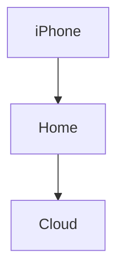

# Possible First Steps
- Value Based Exchange
	- Initial "schema" for common goods and services
	- Escrow oracles
	- QC oracles 
 - Collaborative Graph Editor
	- Typed nodes (schema)
	- Binary blobs
	- Text editor for markdown :) 
- Electronics CAD Tool using it as a data structure
- Text messaging tool (like signal or matrix or whatever)
- Social Network (messaging, sharing photos, files, profile page)

Focus on user experience 

## Key Technical Requirements for MVP

API in a few languages for storing and manipulating a graph using transformations
API for syncing transformations across graphs (assuming network layer is taken care of)

Identity system with public and private keys
Ability to discover other graphs
Ability to do indirection, and synchronize back, including signed verification that the delegated cached values are correct
Some kind of p2p communication system 
Graph permissions based on identities (start with granting access to individual identities)
Perhaps support groups locally
Consensus using some blockchain 

